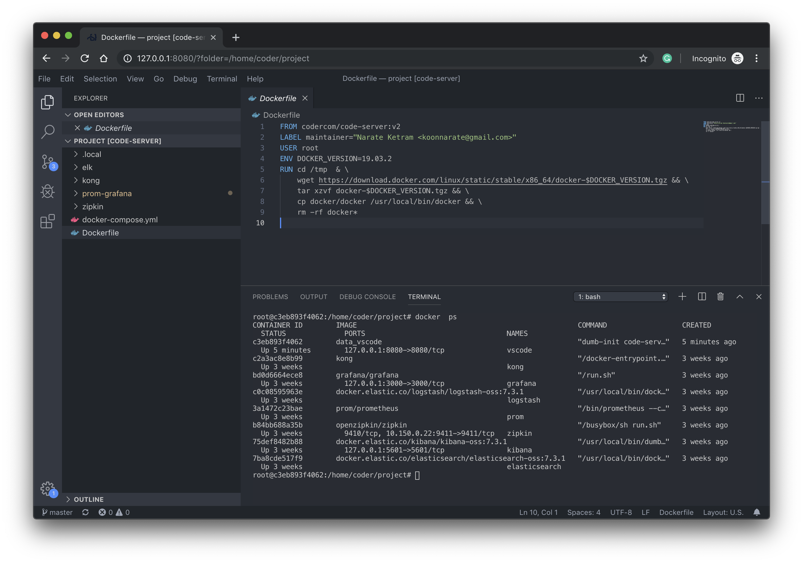

# Deploy code-server

```
docker-compose up -d
```

# Access code-server securely

```
ssh -L 8080:127.0.0.1:8080 user@your-remote-server
```

# Using code-server

http://127.0.0.1:8080/




For more information and reference >> Go to [cdr/code-server](https://github.com/cdr/code-server)
